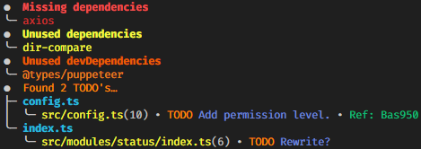
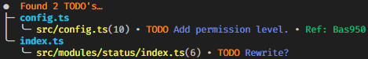
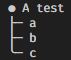

# THIS PACKAGE HAS BEEN MOVED TO [Bas950/Packages](https://github.com/Bas950/packages/tree/main/packages/DisplayAsTree)

# Display As Tree

Simple function to display data as a tree structure.
<br>

<br>
_Screenshot taken from [DevScript](https://www.npmjs.com/package/ts-devscript) to be used as an example._

## Compatability

You are able to pass strings that are colored using [Chalk](https://www.npmjs.com/package/chalk).

## Installation

```bash
# global
npm i -g displayastree

# npm
npm i displayastree

# yarn
yarn add displayastree
```

## Usage

### Tree with inner sections:

```TypeScript
import { Tree, Branch } from "displayastree";

//* Chalk is not needed but is just used in this example.
import chalk from "chalk";

//* Make the main tree.
const tree = new Tree(chalk.hex("#FF8C00")("Found 2 TODO's"));

//* Make branches.
const branchOne = new Branch(chalk.cyan("config.ts")).addBranch([chalk.yellow("src/config.ts")]);
const branchTwo = new Branch(chalk.cyan("index.ts")).addBranch([chalk.yellow("src/modules/status/index.ts")]);

//* Add the branches to the main tree and log
tree.addBranch([branchOne, branchTwo]).log();
```

Will log:
<br>


### Tree without inner sections:

```TypeScript
new Tree("A test").addBranch(["a", "b", "c"]).log();
```

Will log:
<br>


## Options

Simply include the options while creating the Tree instance.

```Typescript
const tree = new Tree("Tree Name", { headChar: "* " });
```

| Options  | Type   | Description                                                     | Default |
| -------- | ------ | --------------------------------------------------------------- | ------- |
| headChar | string | String of the character that the tree will start with.          | `● `    |
| treeChar | string | String of the character that the tree will split with.          | `├─ `   |
| lineChar | string | String of the character that the tree will display at overlaps. | `│ `    |
| lastChar | string | String of the character that the tree will end with.            | `╰─ `   |

**Note**: treeChar, lineChar, and lastChar must have the same length.
